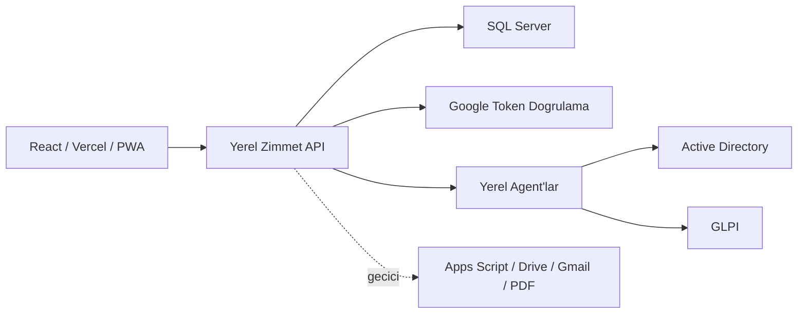

# SQL Server Gecis Plani

Bu proje icin en guvenli gecis modeli, Google Sheets / Apps Script sistemini bir anda kapatmak yerine SQL Server tabanli yerel API'yi paralel calistirmaktir.

## Hedef Mimari



## Neden Araya API Koyuyoruz?

Frontend dogrudan SQL Server'a baglanmamalidir. SQL kullanici adi/parolasi tarayiciya giremez, SQL portu internete acilmamalidir ve rol/kampus yetki kontrolleri backend tarafinda yapilmalidir.

Yerel API su sorumluluklari alir:

- Google login token dogrulama
- Oturum uretme ve saklama
- Kampus / rol yetki kontrolu
- SQL Server okuma-yazma islemleri
- GLPI, AD ve imza ajanlari ile guvenli entegrasyon
- Zimmet, iade, transfer ve sayim kayitlarinda tutarli transaction kullanimi

## Gecis Asamalari

1. Paralel okuma modu
   - SQL tablolarini olustur.
   - Sheets verisini SQL'e aktar.
   - Frontend `VITE_API_URL` ile yerel API'ye yonlendirilebilir hale gelir.
   - Ilk endpoint: `verifyLogin`, `fetchData`, `fetchHardwareHistory`.

2. Yazma islemlerini SQL'e tasima
   - Donanim ekleme/guncelleme
   - Grup, hurda, depo, QR sayim islemleri
   - GLPI kayip cihaz import islemi

3. Zimmet/Iade/Transfer transaction katmani
   - Cihaz durum kontrolu SQL transaction icinde yapilir.
   - PDF uretimi ilk etapta Apps Script'te kalabilir.
   - PDF uretim sonucu SQL'e yazilir.

4. Kuyruk ve worker modeli
   - Yogun donemlerde PDF ve mail islemleri kuyruga alinir.
   - Kullanici arayuzunde "Hazirlaniyor / Tamamlandi / Hata" gorunur.

5. Apps Script'i azaltma
   - Gmail/Drive/PDF ihtiyaci kalirsa Apps Script sadece yardimci servis olur.
   - Istenirse PDF uretimi tamamen yerel worker'a tasinir.

## Frontend Gecis Anahtari

Varsayilan davranis Apps Script'tir.

`.env` dosyasina su satir eklenirse frontend yerel API'ye gider:

```env
VITE_API_URL=http://localhost:8787/api/action
```

Bu sayede test ortaminda SQL API denenirken canli Apps Script bozulmaz.

## Ilk Uygulanacak Endpointler

- `POST /api/action` + `action: "verifyLogin"`
- `POST /api/action` + `action: "fetchData"`
- `POST /api/action` + `action: "fetchHardwareHistory"`
- `GET /health`

Sonraki endpointler ayni `action` isimleri korunarak tasinabilir. Bu, `App.jsx` icindeki buyuk degisikligi azaltir.
